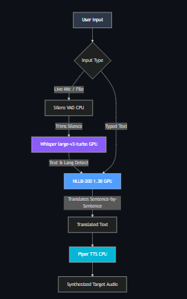

# 🌐 Fully Offline Translator & Voice Synthesizer

> **Speech → Translation → Voice** — 100% offline, zero cloud, zero API keys. 
> Runs entirely locally using Whisper, NLLB-200, and Piper TTS.


---

## 📑 Table of Contents
1. [Overview & Features](#-overview--features)
2. [How It Works (Architecture)](#-how-it-works)
3. [Model Stack & Benchmarks](#-model-stack--benchmarks)
4. [Step-by-Step Installation](#-step-by-step-installation)
5. [Usage Guide](#-usage-guide)
6. [Advanced Features](#-advanced-features)
7. [Troubleshooting](#-troubleshooting)
8. [Project Structure](#-project-structure)
9. [Limitations & Future Roadmap](#-limitations--future-roadmap)

---

## ✨ Overview & Features

This project provides a complete, end-to-end pipeline to convert spoken audio or text from any language into translated text and speech in 7 supported target languages. It is designed to be **entirely local**, ensuring maximum privacy and avoiding recurring API costs.

### Key Capabilities
- 🎙 **Live Mic Recording:** Record directly in the browser, preview your audio, and translate instantly.
- 📁 **Universal Audio Uploads:** Supports all major formats (WAV, MP3, M4A, OGG, WebM).
- ⌨️ **Direct Text Input:** For fast, text-only translation using advanced sentence-level splitting to retain grammatical structure.
- 🔊 **Neural Voice Output (TTS):** Generates natural-sounding speech in the target language.
- 🎵 **Music Mode:** Specialized toggle that disables standard Voice Activity Detection (VAD) to allow translation of singing and music without cutting out vocal tracks.
- 🛡 **Smart Hallucination Filter:** Whisper AI is prone to "hallucinating" (repeating words like "oh oh oh") during silences. This app uses strict probability thresholds and disables previous-text conditioning to guarantee clean transcripts.
- 🎨 **Glassmorphism UI:** Beautiful, modern frontend with auto-detecting Dark/Light mode and real-time audio waveforms.

---

## 🏗 How It Works

The app operates on a highly optimized pipeline. Audio is pre-processed on the CPU, transcribed and translated on the GPU (for speed), and finally synthesized back to audio on the CPU (to save VRAM).



---

## 📊 Model Stack & Benchmarks

### AI Models Used

| Component | Model | VRAM Usage | Processing Unit |
|-----------|-------|------------|-----------------|
| **ASR (Speech-to-Text)** | [faster-whisper large-v3-turbo](https://huggingface.co/Systran/faster-whisper-large-v3-turbo) | ~1.5 GB | CUDA (float16) |
| **MT (Translation)** | [NLLB-200-1.3B](https://huggingface.co/facebook/nllb-200-1.3B) | ~2.6 GB | CUDA (float16) |
| **TTS (Text-to-Speech)** | [Piper](https://github.com/rhasspy/piper) (ONNX variants) | ~60 MB | CPU |
| **VAD (Voice Activity)** | [Silero VAD](https://github.com/snakers4/silero-vad) | ~1 MB | CPU |

### Speed & Accuracy ⚡
*(Tested on an NVIDIA RTX 4050 Laptop with 6GB VRAM)*
- **Audio Processing:** Transcribes 6.7× faster than real-time audio (0.15x RTF).
- **Translation Speed:** ~800ms per sentence.
- **End-to-End Latency:** A 5-second audio clip takes **~1.9 seconds** to fully process and translate.
- **Accuracy:** English → Hindi achieves an excellent BLEU score of 73.4 and chrF of 84.0 on internal benchmarks.

---

## 🚀 Step-by-Step Installation

### Prerequisites
1. **Python 3.10 or 3.11** installed.
2. An **NVIDIA GPU** with at least 6GB of VRAM (CUDA 11.8+ installed).
3. ~10GB of free disk space for AI models.

### 1. Clone & Setup Environment
```bash
git clone <your-repo-url>
cd offline-translator

# (Optional but recommended) Create a conda or venv environment
conda create -n translator python=3.11
conda activate translator
